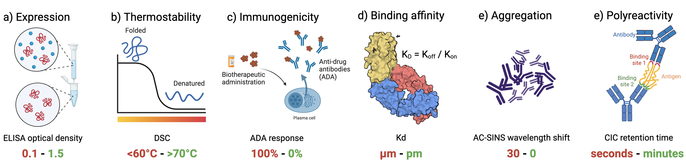

# FLAb: Fitness Landscapes for Antibodies

## Summary

`The Fitness Landscape for Antibodies (FLAb)` is the largest publicly available therapeutic antibody dataset designed to train and benchmark protein AI models. It provides open-access, high-quality developability data on diverse therapeutic properties — expression, thermostability, immunogenicity, aggregation, polyreactivity, binding affinity, and pharmacokinetics — spanning **241 datasets** and over 3 million antibody assay data points aggregated from public studies.

Each dataset is a CSV with `heavy` (and optionally `light`) amino acid sequence columns and a `fitness` column containing the experimental assay value. Additional metadata columns may also be present.

A web interface to FLAb can be found [here](https://r2.graylab.jhu.edu/flab).



## Repository Structure

```
FLAb/
├── data/                  # 241 datasets in 7 therapeutic property categories
├── models/                # Scoring scripts (zero-shot, few-shot, ablation)
├── score/                 # Zero-shot scored outputs per model
├── score_ft/              # Few-shot scored outputs per model
├── score_ablation/        # Ablation study outputs (empty — runs pending)
├── analysis/              # Heatmap and summary analysis scripts
├── metadata/              # Model size tables and summary CSVs used by figures
└── envs/                  # Conda environment YAML files
```

## Data

Datasets are organized by therapeutic property under `data/`. Each category folder has its own README describing each dataset (size, assay units, publication, license, direction of favorable values).

See [`data/README.md`](data/README.md) for the full dataset index.

```
data/
├── aggregation/       (31 datasets)
├── binding/           (132 datasets)
├── expression/        (7 datasets)
├── immunogenicity/    (4 datasets)
├── pharmacokinetics/  (9 datasets)
├── polyreactivity/    (33 datasets)
└── thermostability/   (25 datasets)
```

**Format:** Each CSV has at minimum `heavy` and `fitness` columns. Two-chain antibodies also have `light`. Nanobody datasets have `heavy` only. Fifteen datasets have non-standard fitness column names (`jain2024assessment_*`, `kirby2024retrospective_*`) and are kept as reference but excluded from automated scoring.

## Scoring

All scoring scripts live in `models/` and are run from the `FLAb/` root directory. See [`models/README.md`](models/README.md) for full details.

### Zero-shot scoring

Each `scoring_*.py` script takes a single dataset and a method name:

```bash
python models/scoring_esm2_150M.py data/binding/hie2023efficient_CoV2_S309_Kd.csv esm2_150M_score
```

Output is written to `score/{method_name}/{category}_{dataset}.csv.gz` with columns:
`folder`, `csv`, `{method}`, `{method}_pval`, `{method}_ld`, `{method}_ld_pval`

**Available zero-shot models:** `antiberty`, `iglm`, `ld_score`, `esm2_{8M,35M,150M,650M,3B}`, `esm2_15B`, `bp_{aromaticity,average_flexibility,charge_at_7_4,gravy,instability_index,isoelectric_point,molecular_weight}`, `ism_{3B_uc30,650M_uc30,650M_uc30pdb}`, `progen2_{151M_small,2p7B_bfd90,2p7B_large,6p4B_xlarge,764M_{base,medium,oas}}`, `pyrosetta`, `abmpnn`, `chai1`, `esmif`, `igfold`, `proteinmpnn`

### Few-shot scoring

Few-shot scripts use an 80/10/10 train/val/test split and output to `score_ft/ft_{model}/`:

```bash
python models/ft_scoring_esm2_150M.py data/binding/hie2023efficient_CoV2_S309_Kd.csv ft_esm2_150M_score
```

**Available few-shot models:** `ft_{antiberty,esm2_{8M,35M,150M,650M,3B},esmif,igfold2_{bert,gt,structure},ism_{3B,650M_uc30,650M_uc30pdb},onehot}`

Pre-computed few-shot results are in `score_ft/ft_combined_data.csv`.

## Analysis

Heatmap and correlation analysis scripts are in `analysis/`. See [`analysis/README.md`](analysis/README.md).

```bash
# Generate combined zero-shot heatmap
python analysis/heatmap_all.py

# Generate few-shot heatmap
python analysis/heatmap_all_ft.py
```

Reference data: `analysis/combined_heatmap_all_models.csv` (180 datasets × 30 models matrix), `analysis/flab2025_reference.csv`.

## Install

Create a conda environment for each scoring method:

```bash
conda env create --name ENV_NAME --file envs/ENV.yml
```

Available environments: `antiberty.yml`, `esmif.yml`, `iglm.yml`, `mpnn.yml`, `progen.yml`, `pyrosetta.yml`

Model weights (ISM, ProGen2, AbMPNN, ProteinMPNN) are expected at `~/models/`. See [`models/README.md`](models/README.md) for exact paths.

## Contributions & Bug Reports

FLAb is a living benchmark. To contribute data or models, submit a [pull request](https://github.com/Graylab/FLAb/pulls) or email `mchungy1@jhu.edu`.

For bugs, open a [GitHub issue](https://github.com/Graylab/FLAb/issues).

## Citing this work

```bibtex
@article{chungyoun2025flab2,
    title   = {Fitness Landscape for Antibodies 2: Benchmarking Reveals That Protein AI Models Cannot Yet Consistently Predict Developability Properties},
    author  = {Chungyoun, Michael and Gray, Jeffrey},
    journal = {bioRxiv},
    doi     = {https://doi.org/10.64898/2025.12.27.696706},
    year    = {2025}
}
```

### License

Dataset licenses are listed in [`data/README.md`](data/README.md).
