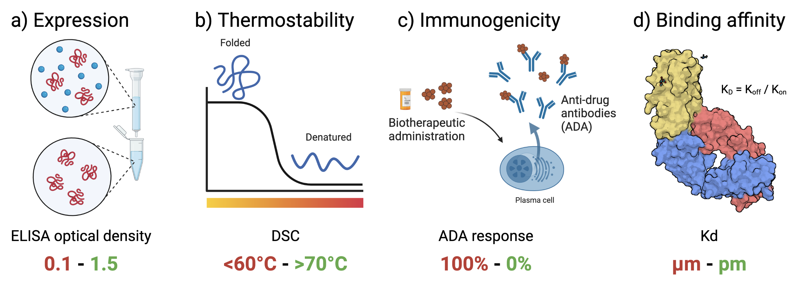

# FLAb
Official repository for FLAb: Benchmarking tasks in Fitness Landscape Inference for Antibodies.



## Install

For easiest use, [create a conda environment](https://docs.conda.io/projects/conda/en/latest/user-guide/tasks/manage-environments.html#creating-an-environment-with-commands) for each scoring model:

```bash
$ example line here
```

## Command line usage

FLAb supports structure prediction with IgFold and uncertainty scoring with AntiBERTy, ProGen2, IgLM, ESM-2, ESM-IF, proteinMPNN, and Rosetta energy.

### Antibody structure prediction from sequence in csv format

Antibody sequences can be provided as a csv of sequences, where the columns are chains `heavy` and `light` and column values are the sequences. This step is necessary to complete first before scoring with structure-based methods (i.e. ESM-IF, proteinMPNN, Rosetta energy).

```bash
$ example line here
```

### Expected output

After the script completes, antibody structures will be saved in a new directory path `structures/`

## Uncertainty scoring

Calculate uncertainty for a csv of sequences with the columns `heavy` for heavy chain sequences, `light` for light chain sequences, and `fitness` for some experimental antibody fitness metric.

```bash
$ example line here
```

### Expected output

After the script completes, the CSV with heavy and light sequences will be updated with a new column for uncertainty. The CSV will be saved in a new directory path within `scores/`

## Bug reports

If you run into any problems while using FLAb, please create a [Github issue](https://github.com/Graylab/FLAb/issues) with a description of the problem and the steps to reproduce it.

## Citing this work

```bibtex
@article{chungyoun2023flab,
    title = {FLAb: Benchmarking tasks in fitness landscape inference for antibodies},
    author = {Chungyoun, Michael and Ruffolo, Jeff and Gray, Jeffrey J},
    journal = {NeurIPS},
    year = {2023}
}
```
